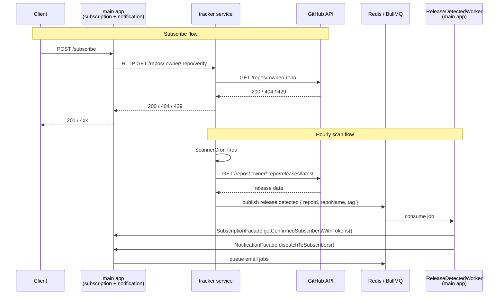

# ADR-004: Extract Tracker Module into a Microservice

Status: Accepted \
Date: 07.06.2026 \
Author: Oleh Korniichuk

## Context

The modular monolith established in ADR-003 proved that `tracker` has a clean boundary: it owns `github_repositories`, has no user-facing HTTP, and communicates with other modules only through two facade calls. Its load profile (hourly cron, GitHub API rate limits) is independent of the subscription/notification load. These properties make it the natural first candidate for extraction.

Two cross-boundary calls must be replaced with network transport:

| Call                                                     | Direction          | Current form |
| -------------------------------------------------------- | ------------------ | ------------ |
| `TrackerFacade.verifyRepository()`                       | main app → tracker | in-process   |
| `SubscriptionFacade.getConfirmedSubscribersWithTokens()` | tracker → main app | in-process   |
| `NotificationFacade.dispatchToSubscribers()`             | tracker → main app | in-process   |

## Decision

### 1. Extract tracker into a standalone service

The tracker module becomes a separate Node.js process with its own deployment unit. The main app retains the `subscription` and `notification` modules.

### 2. Shared database, soft foreign key

Both services connect to the same Postgres instance. The DB-level `REFERENCES github_repositories` foreign key on `subscriptions.github_repository_id` is dropped. The column becomes a plain UUID. Application-level integrity is preserved — tracker creates repo records before subscription stores a reference — but the DB no longer enforces it. This unblocks extraction without any data migration or replication setup.

### 3. HTTP for `verifyRepository` (main app → tracker)

The subscribe flow is synchronous: the user waits for confirmation that the repository exists on GitHub. Tracker exposes a `GET /repos/:owner/:repo/verify` endpoint. The main app calls it during `subscribe()`. Errors (404 not found, 429 rate limited) propagate as HTTP status codes and map to existing `GithubApiError` types.

```
POST /subscribe
  └─▶ tracker HTTP GET /repos/:owner/:repo/verify
        └─▶ GitHub API
```

### 4. BullMQ/Redis queue for release detection (tracker → main app)

The scan flow is fully asynchronous — no user is waiting. When the scanner detects a new release, tracker publishes a `release.detected` job to a shared Redis queue instead of calling facades directly. The main app runs a worker that consumes this event, fetches confirmed subscribers (subscription module), generates unsubscribe tokens, and queues notification emails (notification module).

This eliminates the `tracker → subscription` and `tracker → notification` calls entirely. Tracker publishes facts; the main app decides what to do with them.

```
ScannerCron (tracker)
  └─▶ publishes { repoId, repoName, tag } to [release-detected queue]
        └─▶ ReleaseDetectedWorker (main app)
              ├─▶ SubscriptionFacade.getConfirmedSubscribersWithTokens()
              └─▶ NotificationFacade.dispatchToSubscribers()
```

Job payload:

```typescript
type ReleaseDetectedPayload = {
  repoId: string;
  repoName: string;
  releaseTag: string;
};
```

## Call Diagram



## Alternatives Considered

1. **gRPC for both calls** — Typed and low-latency, but adds proto file management and a build step. Not justified at this scale.

2. **Queue for `verifyRepository`** — Async request/reply over a queue (correlation IDs, callback queues) is significantly more complex than HTTP for an inherently synchronous operation where the user is waiting.

3. **Split the database** — Gives full autonomy per service but requires data replication or an API for cross-service lookups. Premature before traffic patterns justify it. Revisit when the `github_repositories` table needs independent scaling or a separate ownership team.

4. **Keep shared DB FK** — Prevents dropping the constraint without a migration, and breaks the moment the DB is split. Dropping the FK now costs nothing and keeps options open.

## Consequences

- **Positive**: Tracker can be deployed, scaled, and restarted independently. A tracker crash no longer affects the subscribe/unsubscribe HTTP flow. GitHub API rate limit exhaustion is isolated. The `release.detected` queue decouples scan throughput from email delivery throughput.
- **Negative**: `verifyRepository` adds a network hop to the subscribe flow (latency + availability dependency on tracker). The shared DB remains a coupling point until explicitly split. Developers must keep the `release.detected` job schema stable across both codebases.
