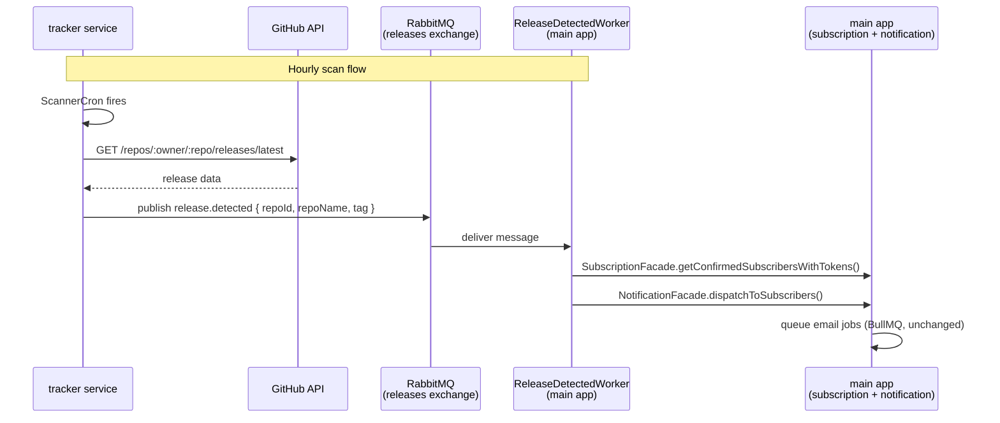

# ADR-005: Replace BullMQ with RabbitMQ for Cross-Service Transport

Status: Accepted \
Date: 13.06.2026 \
Author: Oleh Korniichuk

## Context

ADR-004 extracted the tracker into a standalone microservice and chose BullMQ/Redis as the transport for the `release.detected` event (tracker → main app). That was the right call at the time: Redis was already present for caching, and BullMQ provided retries and persistence with minimal new infrastructure.

As the system evolves toward multiple microservices, this choice has three growing problems:

1. **Redis is doing two jobs.** The same Redis instance serves as a route-level HTTP cache _and_ as a message store for cross-service events. These concerns have different scaling, eviction, and availability requirements.

2. **No routing or fan-out.** BullMQ queues are point-to-point. If a second consumer (e.g., an analytics service) needs to react to `release.detected`, the tracker producer must be changed to publish to a second queue. With a proper broker, new consumers bind to the existing exchange — the producer is untouched.

3. **Semantic mismatch.** BullMQ is a job queue: it models units of work with states (waiting, active, completed, failed). Cross-service events are a different abstraction — facts that happened, not tasks assigned to a worker. The mismatch becomes more visible as the event vocabulary grows.

The `email-queue` and `scanner-queue` remain on BullMQ: they are intra-service queues that benefit from BullMQ's job scheduling (cron repeat) and per-job retry semantics, and they do not cross a service boundary.

## Decision

Replace the `release-detected-queue` (BullMQ/Redis) with a **RabbitMQ topic exchange**.

### Topology

```
Exchange: releases          (type: topic, durable)
Routing key: release.detected
Queue: release.detected     (durable, bound to exchange with key release.detected)
```

The tracker publishes to the `releases` exchange with routing key `release.detected`. The main app declares and consumes the `release.detected` queue bound to that exchange.

### Payload

Unchanged from ADR-004:

```typescript
type ReleaseDetectedPayload = {
  repoId: string;
  repoName: string;
  releaseTag: string;
};
```

### Retry / durability

- Exchange and queue declared durable; messages published persistent.
- Consumer uses manual acknowledgement: `ack` on success, `nack` with `requeue: false` on unrecoverable error (routes to dead-letter queue if configured).
- Application-level retry is not reimplemented in the initial migration; the existing `attempts: 3` behaviour from BullMQ is superseded by the nack/dead-letter pattern.

### Infrastructure

RabbitMQ added as a service in `docker-compose.yml`. Connection URL injected via `RABBITMQ_URL` env var (parsed in `src/config/envs.ts`).

### Updated call diagram



## Alternatives Considered

1. **Keep BullMQ** — no new infrastructure, retries built-in. Rejected: Redis-as-broker is a semantic abuse that compounds as services multiply; point-to-point topology requires producer changes for each new consumer.

2. **Kafka** — superior throughput and replay guarantees for high-volume event streams. Rejected: overkill at this scale (hourly cron, O(100) subscribers); operational complexity (ZooKeeper/KRaft, partition management) is disproportionate to the problem; no built-in per-message TTL or retry UI.

3. **Full BullMQ → RabbitMQ migration** (including `email-queue` and `scanner-queue`) — consistent broker story. Rejected: `scanner-queue` relies on BullMQ's `repeat` cron feature; `email-queue` relies on per-job retry with exponential backoff. Replicating both in RabbitMQ adds scope with no cross-service benefit — these queues never leave their owning service.

## Consequences

- **Positive**: Clear infrastructure roles — Redis for caching, RabbitMQ for service-to-service events. Future consumers (analytics, alerting) bind to the `releases` exchange without any change to the tracker. AMQP semantics (exchanges, routing keys, dead-letter queues) model the event-driven domain more accurately than job queues.

- **Negative**: New infrastructure dependency to operate and monitor. Connection lifecycle (reconnection on broker restart, channel recovery) must be handled explicitly — BullMQ abstracted this via ioredis. The `release.detected` message schema is now a cross-service contract; breaking changes require coordinated deployment of both services.
