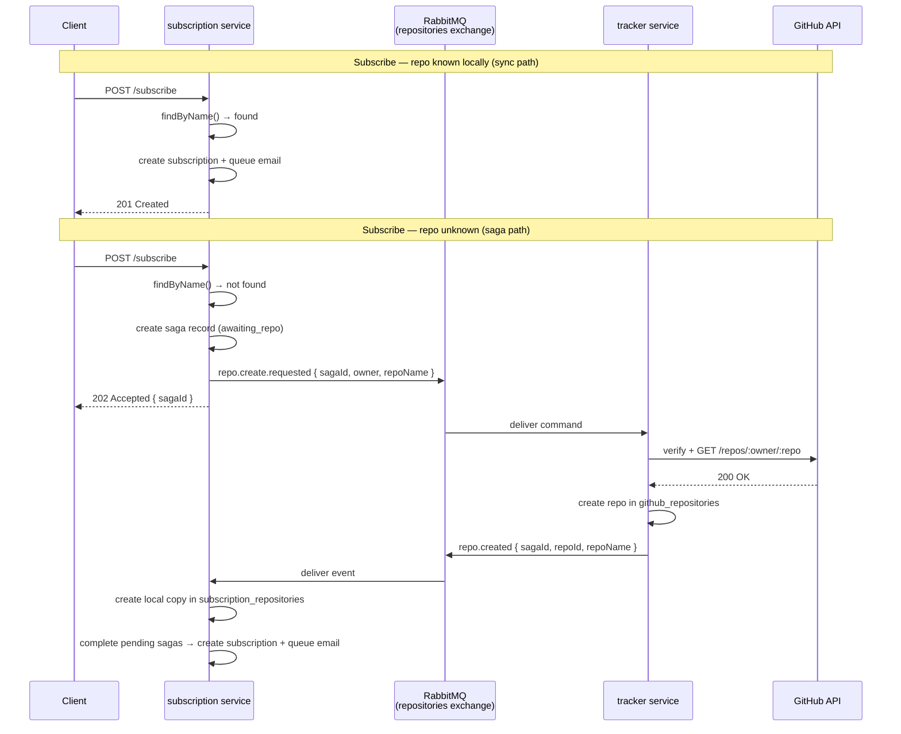

# ADR-006: Split Repository Table Ownership and Introduce Choreography Saga

Status: Accepted \
Date: 19.06.2026 \
Author: Oleh Korniichuk

## Context

ADR-004 extracted tracker into a separate microservice but kept a shared `github_repositories` table accessed by both services. ADR-004 explicitly deferred the DB split as premature. Two problems have since made that deferral untenable:

1. **Violated ownership.** The subscription service directly inserts rows into `github_repositories` during `subscribe()`. This means two services share write access to one table — a cross-boundary mutation that breaks the microservice contract. Tracker owns that data; the subscription service should not write to it.

2. **Synchronous coupling on the subscribe path.** The HTTP call to `tracker.verifyRepository()` introduced in ADR-004 ties the subscribe response latency to tracker's availability. If tracker is down or slow, `POST /subscribe` fails for the user. The coupling also prevents tracker from being deployed independently without affecting the subscription API.

The subscribe flow had these tightly coupled steps:
1. Call tracker HTTP to verify repo exists on GitHub
2. Insert into `github_repositories` (tracker-owned table — wrong)
3. Create subscription row
4. Queue confirmation email

Steps 1 and 2 must move out of the subscription service.

## Decision

### 1. Split table ownership

- **Tracker** retains exclusive ownership of `github_repositories` (id, name, last_seen_tag).
- **Subscription service** gets its own `subscription_repositories` table (id, name only) as an eventually-consistent read copy. It never writes to `github_repositories`.

### 2. Choreography saga for new repo creation

When a user subscribes to a repo not yet in the subscription service's local copy, a choreography saga coordinates creation across both services via RabbitMQ:

```
Subscription service          RabbitMQ (repositories exchange)          Tracker
        │                                                                    │
        │── repo.create.requested ──────────────────────────────────────▶  │
        │   { sagaId, owner, repoName }                                     │
        │                                                          verify GitHub API
        │                                                          create in tracker DB
        │  ◀─────────────────────────── repo.created ────────────────────  │
        │   { sagaId, repoId, repoName }                                    │
  create local copy                                                          │
  create subscription                                                        │
  queue confirm email                                                        │
```

On failure (repo not on GitHub, rate limited):

```
        │  ◀─────────────────────────── repo.create.failed ──────────────  │
        │   { sagaId, reason, message }                                     │
  mark saga failed                                                           │
```

### 3. Saga state persistence

A `subscribe_sagas` table tracks each in-flight subscription attempt:

```
id          UUID PK
email       VARCHAR
repo_name   VARCHAR
status      VARCHAR  -- 'awaiting_repo' | 'completed' | 'failed'
failure_reason VARCHAR nullable
created_at  TIMESTAMP
```

This survives process restarts and enables compensation without distributed locks.

### 4. Updated API contract

`POST /subscribe` returns:
- **201 Created** — repo already in local copy; subscription created synchronously, confirmation email queued immediately.
- **202 Accepted** — repo not yet in local copy; saga started, subscription will be created once tracker confirms the repo.

### 5. RabbitMQ topology

```
Exchange: repositories   (type: topic, durable)

Routing key                  Direction           Queue
repo.create.requested        sub → tracker       repo.create.requested
repo.created                 tracker → sub       repo.events
repo.create.failed           tracker → sub       repo.events
```

The existing `releases` exchange (ADR-005) is unchanged.

## Call Diagram



## Alternatives Considered

1. **Keep shared `github_repositories` table** — Zero migration cost, but preserves the ownership violation indefinitely. Each new service would need write access to tracker's table. Rejected.

2. **Orchestration saga (central coordinator)** — A `SubscribeSaga` class would call tracker synchronously and manage rollback state in-process. Simpler to reason about, but re-introduces synchronous coupling on the subscribe path (the problem we're solving). Rejected.

3. **Keep `verifyRepository` HTTP call, just stop writing to tracker's table** — Subscription service would verify via HTTP but store repo copy differently. Still couples subscribe latency to tracker availability. Rejected.

4. **Return 202 for all subscribe requests** — Simplifies the API contract but degrades the UX for the majority case (repo already known). The sync 201 path is fast and should remain. Rejected.

## Consequences

- **Positive**: Subscription service and tracker have clean data ownership — no cross-service writes. Tracker can be deployed independently without affecting the subscribe API for known repos. The saga pattern makes the distributed transaction explicit, with failure states persisted in `subscribe_sagas`.
- **Negative**: New repos produce an async 202 response; clients cannot assume the subscription is immediately active. Saga records in `awaiting_repo` state accumulate if tracker is unavailable; a cleanup/retry mechanism is not implemented in this iteration. The `subscription_repositories` table is a read copy that can diverge from tracker if events are lost (mitigated by durable queues and manual ack).
