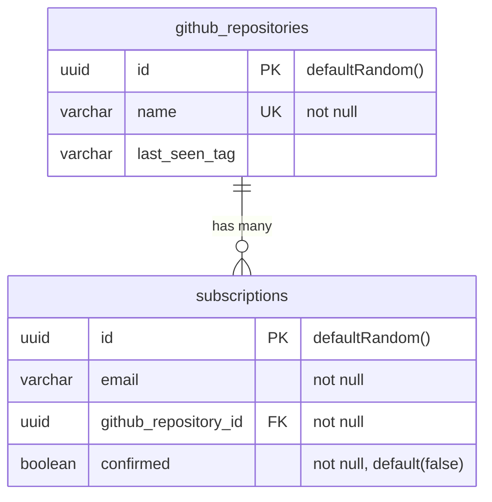
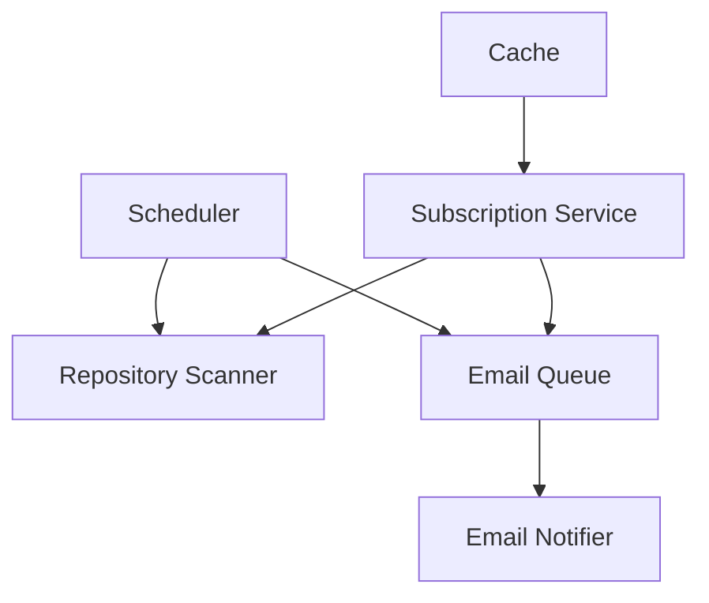
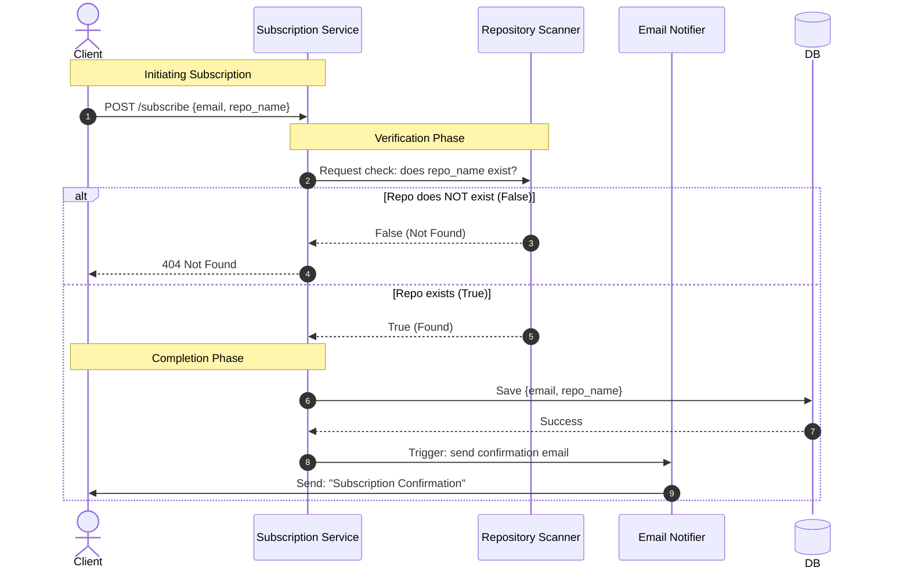
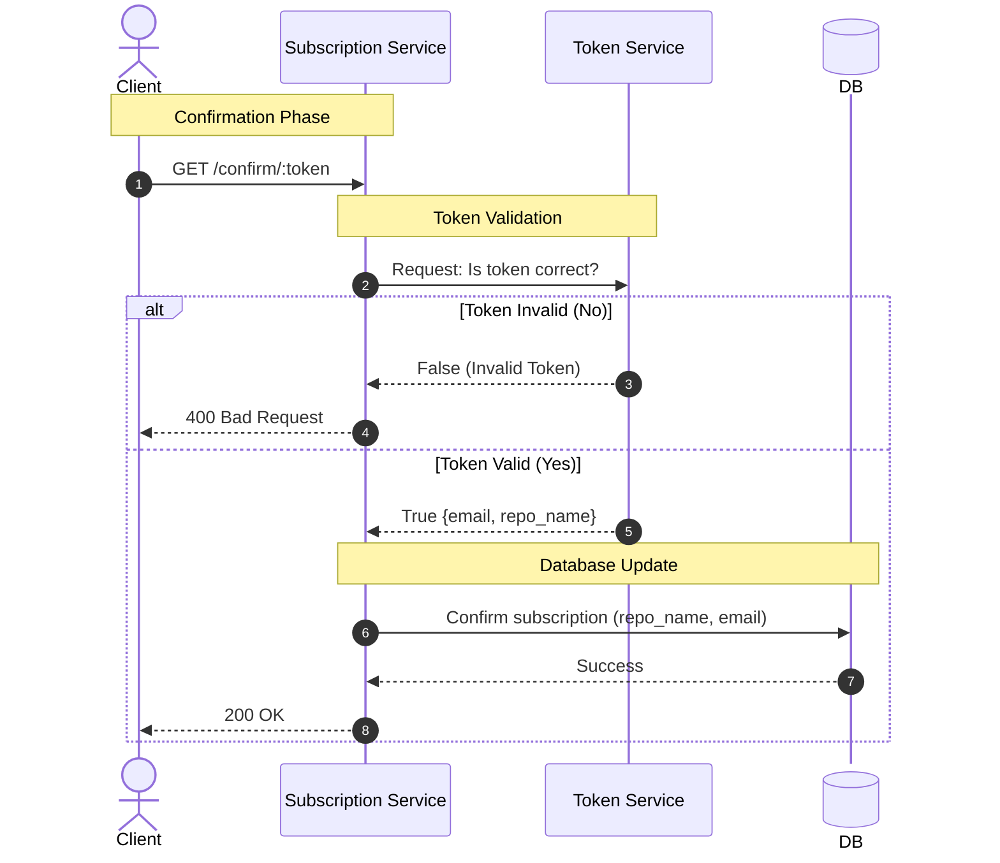
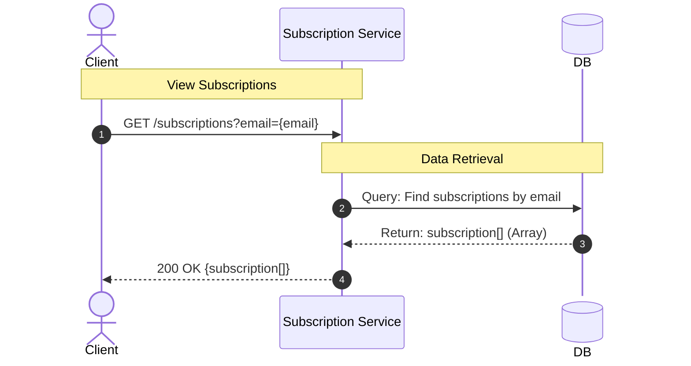

# SDD-001: Github Repository Scanner

## 1. System Requirements

### Functional Requirements

- User should be able to subscribe to release updates for a github repository
- In order to subscribe for updates user should provide his email address and confirm it by clicking a link in an email
- After subscribing user should start receiving updates via email
- User should be able to unsubscribe from notifications by clicking a link provided with every notification email
- User should be able to view a list of his subsctiptions by email
- Service should expose a REST API

### Non-functional Requirements

- **High Reliability** - SLA 99%
- **Responsivness** - <400ms response time
- **Scalability** - should be ready to send 2000 notifications in 1 update cycle without increasing response time
- **Ease of Use** - confirming email & unsubscribing from notifications should be done in 1 click

### Constraints

- **Time** - 1 week
- **Team** - 1 engineer
- **Technologies** - lean web framework (Express or Fastify)

## 2. System Overview

### Tech Stack

- Framework - ExpressJS
- Database - Postgres
- ORM - DrizzleORM
- Containerization - Docker & docker-compose
- Migrations - Drizzle Kit
- Email Agent - nodemailer
- Caching - Redis
- Task Scheduling - BullMQ
- Task Queue - BullMQ
- Monitoring - Prometheus

### API Endpoints

- POST /subscribe { email: string; repo: string; }
- GET /confirm:/token
- GET /unsubscribe/:token
- GET /subscriptions?email

### Database Schema

### High-level Architecture

## 3. Application Flows

- Subscription Flow

- Confirm Subscription Flow

- View Subscriptions Flow

- Unsubscribe Flow

